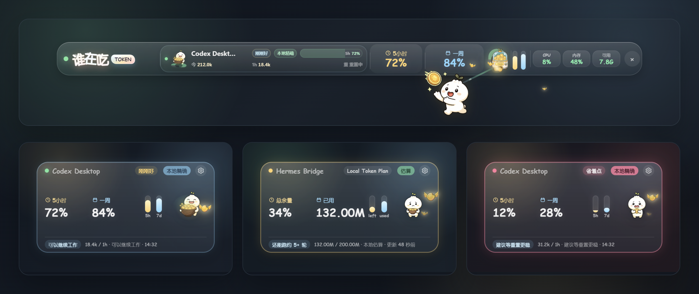
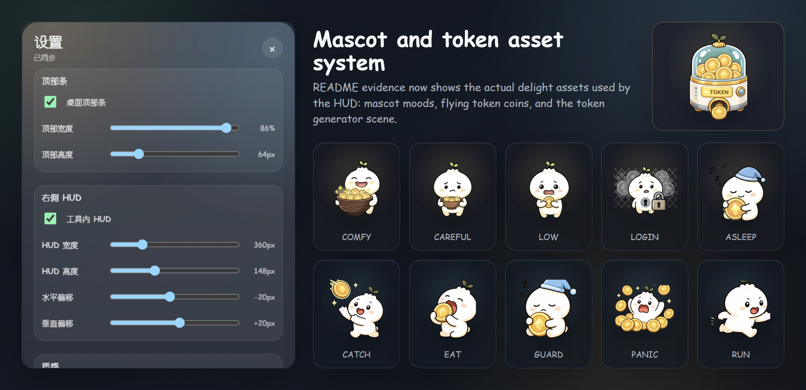
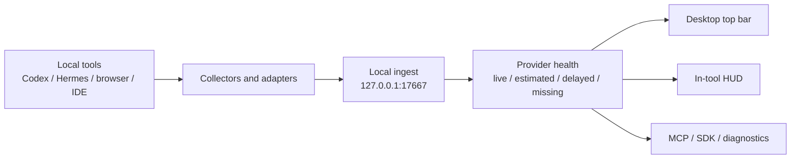

# 谁在吃 token

一个本地优先的 LLM token / quota 桌面 HUD。

它把 Codex、Hermes、浏览器工具、IDE、SDK wrapper 和 MCP agent 的用量信号收进本机，把“还能不能继续工作”从一团猜测变成桌面上看得见的小状态。

> Source beta: this repository is public for review, contribution, and adapter work. It is not yet a polished signed binary release.

## 项目初衷

AI 工具越来越像工作台上的灯：随手打开、随手询问、随手让它接住一个正在发散的念头。可 token 和 quota 往往藏在背后，像墙里的水流，只有突然断流时才被看见。

《谁在吃 token》想做的不是一个更吵的仪表盘，而是一盏很轻的小灯。它安静地待在桌面边缘，告诉你当前余量靠不靠谱，哪一个工具正在消耗，什么时候适合继续推进，什么时候最好收一收。数字要清楚，边界要诚实，提醒要克制；人在思考时，不应该总被工具的账单和限制打断。

所以这个项目的核心不是“统计更多”，而是“让本机 AI 工作流变得可感知、可解释、可维护”。

## 快速理解

| 维度 | 说明 |
| --- | --- |
| 它是什么 | Windows 10+ / macOS 桌面监控工具，显示 LLM token、quota、上下文、信用额度和本地 adapter 健康状态。 |
| 它不是什么 | 不是云端遥测平台，不收集 prompt/completion，不承诺所有 provider 都有官方精确余量。 |
| 默认边界 | 只使用本机数据和 localhost 服务；敏感凭据、Cookie、数据库和日志不应提交或公开。 |
| 当前阶段 | `v0.1.0-source-beta`，源码、协议、adapter 和维护守卫已公开；签名安装包仍需更多真机验证。 |

## 截图

截图由 `npm run screenshots:readme` 使用脱敏 mock 数据生成，不代表真实账号用量。





## 核心能力

- 桌面顶栏：在桌面或空闲状态显示全局 token / quota / 系统状态。
- 工具内 HUD：进入 Codex、Hermes 等工具窗口时，显示更贴近当前工具的轻量 HUD。
- Codex 本地读取：读取本机 Codex session JSONL 里的 `token_count` 与 rate limit 元数据。
- Hermes 本地用量：读取 Hermes 本地状态，支持 OpenAI-compatible bridge 的 `usage` 上报。
- Token Plan 口径：可用 Credits 形式展示总量、已用、剩余、账期和估算可信度。
- Localhost 协议：通过 `/events`、`/snapshot`、`/health` 给 adapter、SDK、MCP 和 CLI 使用。
- Adapter 生态：提供浏览器扩展、VS Code/Cursor adapter、Node SDK、MCP server、插件和 skill 骨架。
- 维护守卫：内置 release readiness、secret scan、license check、support bundle、adapter fixture 和 review 工具。

## 它怎样工作



所有 UI 都读同一份 `providerHealth`：
`displayMode` 决定显示 5 小时窗口、Token Plan、上下文窗口还是普通用量；`trust` 解释数据来源和可信度；`delight` 决定小人状态、颜色和低余量提示。

## 数据口径

| 来源 | 显示口径 | 准确性说明 |
| --- | --- | --- |
| Codex Desktop | `5小时 / 一周` | 来自本机 `token_count` 事件和 rate limit 窗口，标记为本地精确。 |
| Hermes Local | 会话用量、上下文、Token Plan | 本地数据库和 bridge usage 可用；平台总量需要显式配置 Cookie，否则标记为估算。 |
| Browser adapter | HUD 遮挡矩形、可见 quota、显式 usage | 不抓 prompt/completion；usage 必须由页面或脚本明确提供。 |
| VS Code / Cursor | 本机 `/health` 状态栏、显式 snapshot 命令 | 不读取源码，不拦截 IDE 私有 AI 请求。 |
| SDK / gateway | OpenAI-compatible `usage` | wrapper 在模型调用完成后 best-effort 上报，失败不影响真实请求。 |

## 项目结构

| 路径 | 作用 |
| --- | --- |
| `src/main.cjs` | Electron 主入口，窗口、托盘、本地服务和 collector 编排。 |
| `src/renderer/` | 桌面顶栏、HUD、设置页和视觉状态。 |
| `src/collectors/` | Codex、Hermes、本地系统状态等数据采集。 |
| `src/protocol/` | usage event、provider health、quota delight 等协议模型。 |
| `src/security/` | 本机 token、Origin 限制、敏感值过滤等安全边界。 |
| `src/sdk/` | `who-eats-token/sdk`，给本地 wrapper 和 gateway 使用。 |
| `src/mcp/` | 让 agent 读取本机状态的 MCP server。 |
| `adapters/` | 浏览器扩展、VS Code/Cursor adapter 和 provider adapter 模板。 |
| `plugins/`、`skills/` | Codex 插件和本地 setup/doctor/adapter-author skill。 |
| `scripts/` | 测试、发布检查、诊断包、截图生成、adapter fixture 等维护脚本。 |
| `docs/` | 协议、安全、adapter、发布、兼容性和 beta 路线文档。 |

## 运行

```powershell
npm install
npm start
```

启动后本机 API 默认监听：

```text
http://127.0.0.1:17667
```

第一次使用建议按这个顺序看：

1. [第一次使用](docs/getting-started.md)
2. [Agent 接入指南](docs/agent-getting-started.md)
3. [本地事件协议](docs/protocol.md)
4. [Adapter Guide](docs/adapter-guide.md)

## 本地 API 最小事件

首次启动会生成本机访问 token。Windows 默认位置：

```powershell
$token = (Get-Content "$env:APPDATA\who-eats-token\api-token.txt" -Raw).Trim()
```

发送一条最小 usage event：

```powershell
Invoke-RestMethod -Method Post `
  -Uri http://127.0.0.1:17667/events `
  -Headers @{ "X-Who-Eats-Token" = $token } `
  -ContentType application/json `
  -Body '{"provider":"openai","model":"gpt-4o","input_tokens":1200,"output_tokens":480}'
```

读取当前聚合状态：

```powershell
Invoke-RestMethod http://127.0.0.1:17667/snapshot `
  -Headers @{ "X-Who-Eats-Token" = $token }
```

协议字段、别名、overlay 上报和 `/health` 说明见 [docs/protocol.md](docs/protocol.md)。

## Adapter 路线

新增工具接入时，优先选择最小、可关闭、可审查的路径：

| Adapter 类型 | 适用场景 | 入口 |
| --- | --- | --- |
| Local gateway bridge | OpenAI-compatible API、Hermes、LiteLLM | [docs/adapter-guide.md](docs/adapter-guide.md) |
| Browser extension | ChatGPT、Claude、Gemini、Hermes Web UI | [docs/browser-extension.md](docs/browser-extension.md) |
| IDE extension | VS Code、Cursor 状态栏 | [docs/ide-extension.md](docs/ide-extension.md) |
| Node SDK wrapper | 本地脚本、网关、社区工具 | [docs/node-sdk.md](docs/node-sdk.md) |
| MCP server | Agent 读取本机余量与健康状态 | [docs/mcp-server.md](docs/mcp-server.md) |
| Adapter fixture | 没有真实宿主时先验证协议和脱敏边界 | [docs/adapter-fixture.md](docs/adapter-fixture.md) |

新增 adapter 前请看 [Adapter Catalog](docs/adapter-catalog.md)、[Adapter Signal Matrix](docs/adapter-signal-matrix.md) 和 [Adapter Review](docs/adapter-review.md)。

跨平台状态见 [docs/compatibility.md](docs/compatibility.md)，机器可读矩阵见 [docs/compatibility-matrix.md](docs/compatibility-matrix.md)。

## 安全与隐私边界

- 默认没有遥测、分析后台或云端存储。
- 不收集 prompt、completion、源码、API key、provider Cookie、bearer token、local API token、原始数据库或完整聊天内容。
- 浏览器来源必须来自 localhost、`127.0.0.1` 或已安装扩展 origin，并携带本机访问 token。
- Hermes Web UI 文件注入是显式 opt-in，普通启动不会修改第三方目录。
- 公开 issue、截图、诊断包前先运行 `npm run secret:scan`。

更多细节见 [SECURITY.md](SECURITY.md)、[PRIVACY.md](PRIVACY.md) 和 [docs/threat-model.md](docs/threat-model.md)。

## 常用命令

日常开发：

```powershell
npm run check
npm run test:docs
npm run status
npm run diagnostics
```

协议和 adapter：

```powershell
npm run test:protocol
npm run test:adapter-contract
npm run adapter:review
npm run adapter:fixture
npm run test:adapter-catalog
```

发布前守卫：

```powershell
npm run secret:scan
npm run license:check
npm run release:check
npm run release:check -- --list
npm run release:gaps -- --target source-beta --require-source-beta
npm run release:summary -- --require-source-beta
```

完整脚本清单以 [package.json](package.json) 为准。

维护入口保持分散在文档里，README 只保留导航：

| 主题 | 文档 | 常用命令 |
| --- | --- | --- |
| 性能与卡顿 | [docs/performance-budget.md](docs/performance-budget.md)、[docs/stability.md](docs/stability.md) | `npm run performance:summary`、`npm run lag:triage` |
| 诊断与支持包 | [docs/diagnostics.md](docs/diagnostics.md)、[docs/support-bundle.md](docs/support-bundle.md) | `npm run diagnostics`、`npm run support:bundle` |
| 轻量趣味交互 | [docs/delight-contract.md](docs/delight-contract.md) | `npm run delight:contract` |
| 兼容性矩阵 | [docs/compatibility-matrix.md](docs/compatibility-matrix.md) | `npm run compatibility:matrix` |
| 许可证与证据 | [docs/license-policy.md](docs/license-policy.md)、[docs/release-evidence.md](docs/release-evidence.md) | `npm run release:evidence-report -- --check`、`npm run release:evidence-quality` |
| 打包验证 | [docs/release.md](docs/release.md)、[docs/manual-validation.md](docs/manual-validation.md) | `npm run package:dir`、`npm run soak:packaged-win` |

## 当前状态与路线

当前仓库适合作为 source beta 接受审阅和贡献。公开二进制发布前仍需要补齐：

- macOS 真机 packaged smoke/soak 与权限状态验证。
- Windows Authenticode 签名。
- macOS Developer ID 签名和 notarization。
- 浏览器/IDE adapter 的更多手动 UX 验证。

路线和 reviewer 证据见：

- [Source Beta Next Steps](docs/beta-release-next-steps.md)
- [Release Readiness](docs/release-readiness.md)
- [Risk Register](docs/risk-register.md)
- [Open Source Strategy](docs/open-source-form-strategy.md)
- [Open Source Landscape](docs/open-source-landscape.md)
- [TokenTracker Lessons](docs/token-tracker-lessons.md)

## Contributing

欢迎贡献 adapter、协议测试、真机验证、HUD 细节和诊断工具。贡献前请先看 [CONTRIBUTING.md](CONTRIBUTING.md)。

最重要的规则很简单：只上报用量、余量、状态和紧凑元数据；不要把人的提示词、回答、源码、密钥或账号凭据带进这个项目。
