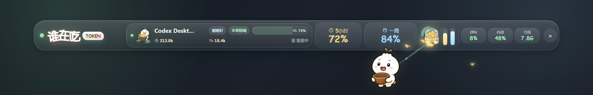
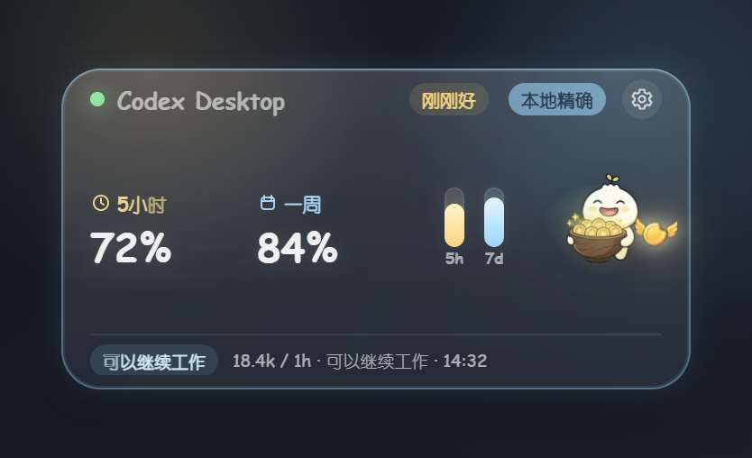
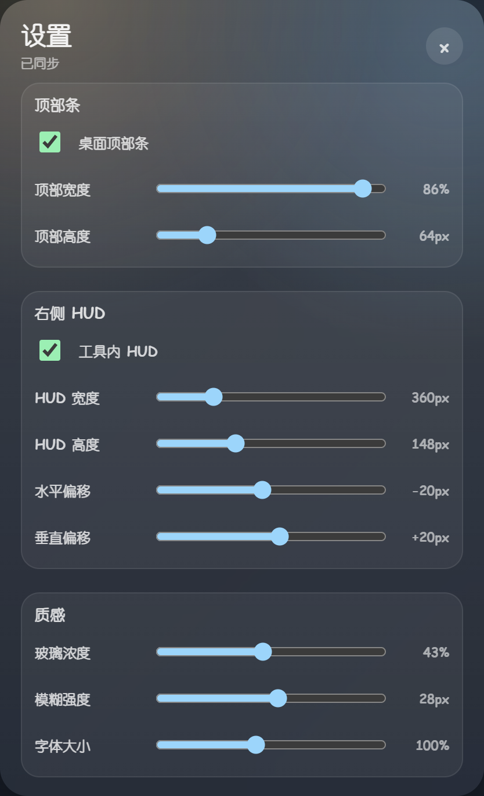

# 谁在吃 token

## English Overview

Who Eats Token is a local-first desktop monitor for LLM token and quota visibility. It keeps usage data on the user's machine, shows a low-overhead Windows/macOS HUD, exposes a localhost event protocol, and provides adapter paths for Codex, Hermes, browser tools, IDEs, SDK wrappers, and MCP clients.

The project is a source beta, not a claim to be the first or only token tracker. Its open-source value is the maintainer-friendly boundary: the desktop app owns realtime HUD and local aggregation, adapters own tool-specific usage capture, MCP exposes agent-readable status, and skills/plugins help with setup, diagnostics, and adapter authoring. See [docs/open-source-form-strategy.md](docs/open-source-form-strategy.md), [docs/risk-register.md](docs/risk-register.md), and [docs/beta-release-next-steps.md](docs/beta-release-next-steps.md) for reviewer-facing evidence and next steps.

For OSS maintainers and reviewers:

- Local-first by default: no telemetry, no hosted backend, and no prompt/completion collection.
- Maintainer workflow ready: CI, release readiness checks, adapter review tools, secret scanning, license checks, diagnostics, and redacted support bundles.
- Security-sensitive surfaces are documented: localhost APIs, browser/IDE adapters, MCP tools, optional bridge traffic, local credential files, and [threat model](docs/threat-model.md).

## Screenshots

Generated with sanitized mock data via `npm run screenshots:readme`.



<p>
  
  
</p>

本地低占用 LLM 容量监控顶栏，目标平台是 Windows 10+ 和 macOS：

- 读取 Codex Desktop 本地 `token_count` 事件，显示 5 小时和 7 天窗口占用。
- 在屏幕顶部显示 always-on-top 小条。
- 暴露本地 ingest 接口，后续可以让 TokenScope、toktap、LiteLLM 或自写 SDK wrapper 把每次调用的 token/cost 推进来。

第一次使用先看 [用户指南](docs/getting-started.md)。如果你要让本地工具里的 agent 读取状态或上报 usage，看 [Agent 接入指南](docs/agent-getting-started.md)。

跨平台状态和已知缺口见 [docs/compatibility.md](docs/compatibility.md)。
机器可读兼容矩阵见 [docs/compatibility-matrix.md](docs/compatibility-matrix.md)。
开源形态和接入路线见 [docs/open-source-form-strategy.md](docs/open-source-form-strategy.md)。
GitHub 同类项目调研和定位边界见 [docs/open-source-landscape.md](docs/open-source-landscape.md)。
TokenTracker 深度学习和轻量趣味交互突破点见 [docs/token-tracker-lessons.md](docs/token-tracker-lessons.md)。
竞品差异化和 beta 产品路线见 [docs/competitive-differentiation-plan.md](docs/competitive-differentiation-plan.md)。
下一步像素级产品设计方案见 [docs/next-product-design-plan.md](docs/next-product-design-plan.md)。
轻量趣味交互契约见 [docs/delight-contract.md](docs/delight-contract.md)。
本地事件协议见 [docs/protocol.md](docs/protocol.md)，新工具接入指南见 [docs/adapter-guide.md](docs/adapter-guide.md)。
Adapter 支持目录见 [docs/adapter-catalog.md](docs/adapter-catalog.md)。
Adapter 信号兼容矩阵见 [docs/adapter-signal-matrix.md](docs/adapter-signal-matrix.md)。
Adapter 贡献模拟器见 [docs/adapter-fixture.md](docs/adapter-fixture.md)。
Agent/MCP 接入见 [docs/mcp-server.md](docs/mcp-server.md)。
Agent skills 见 [docs/skills.md](docs/skills.md)。
Codex 插件骨架见 [docs/plugin.md](docs/plugin.md)。
浏览器网页工具接入见 [docs/browser-extension.md](docs/browser-extension.md)。
Node/JS wrapper 接入见 [docs/node-sdk.md](docs/node-sdk.md)。
TokenTracker/ccusage 等外部摘要导入见 [docs/external-summary-import.md](docs/external-summary-import.md)。
IDE 状态栏接入见 [docs/ide-extension.md](docs/ide-extension.md)。
低内存和稳定性预算见 [docs/performance-budget.md](docs/performance-budget.md)。
已知风险和开源维护守卫见 [docs/risk-register.md](docs/risk-register.md)。
安全威胁模型见 [docs/threat-model.md](docs/threat-model.md)。
依赖许可证策略见 [docs/license-policy.md](docs/license-policy.md)。
打包发布流程见 [docs/release.md](docs/release.md)，真机验证清单见 [docs/manual-validation.md](docs/manual-validation.md)。
发布 readiness 总审计见 [docs/release-readiness.md](docs/release-readiness.md)。
源码 beta 后续阻塞处理步骤见 [docs/beta-release-next-steps.md](docs/beta-release-next-steps.md)。
本地状态/doctor 命令见 [docs/status.md](docs/status.md)。
卡顿/内存/稳定性诊断命令见 [docs/stability.md](docs/stability.md)。
可分享的脱敏诊断包见 [docs/diagnostics.md](docs/diagnostics.md)。
公开 issue/性能排查支持包见 [docs/support-bundle.md](docs/support-bundle.md)。

## 运行

```powershell
npm install
npm start
```

## 开源安全边界

- 默认只使用本机数据和 localhost 服务，不包含遥测或云端后台。
- 本地访问 token、供应商 Cookie、SQLite 数据库和调试日志都已加入忽略规则，不应提交。
- Hermes Web UI 文件注入是显式 opt-in，不会在普通启动时自动修改第三方目录。
- 贡献前请先看 [SECURITY.md](SECURITY.md)、[PRIVACY.md](PRIVACY.md) 和 [CONTRIBUTING.md](CONTRIBUTING.md)。

## 快照调试

```sh
npm run snapshot
npm run status
npm run status -- --json
npm run stability
npm run stability -- --json
npm run diagnostics
npm run diagnostics -- --json
npm run lag:triage
npm run lag:triage -- --json
npm run support:bundle
npm run support:bundle -- --json
npm run delight:contract
npm run delight:contract -- --json
npm run performance:summary
npm run performance:summary -- --json
npm run manual:preflight -- --platform windows
npm run adapter:manual-readiness
npm run adapter:review
npm run adapter:fixture
npm run adapter:fixture -- --json
npm run compatibility:matrix
npm run compatibility:matrix -- --json
npm run compatibility:matrix -- --check
npm run adapter:guard
npm run secret:scan
npm run license:check
npm run release:summary
npm run release:summary -- --json
npm run release:validation-pack -- --platform all
npm run validation:next
npm run validation:next -- --target browser
npm run validation:template -- --target browser
npm run release:evidence -- --list
npm run release:evidence-quality
npm run release:evidence-quality -- --require-clean
npm run release:evidence-report -- --check
npm run release:gaps
npm run signing:readiness -- --platform all
npm run release:check -- --list
npm run release:check -- --list --json
npm run check
npm run test:protocol
npm run test:browser-extension
npm run test:browser-extension-runtime
npm run test:browser-host-smoke
npm run test:ide-host-smoke
npm run test:node-sdk
npm run test:local-health
npm run test:provider-health
npm run test:quota-delight
npm run test:delight-contract
npm run test:external-summary-import
npm run test:status
npm run test:stability
npm run test:diagnostics
npm run test:lag-triage
npm run test:support-bundle
npm run test:secret-scan
npm run test:license-check
npm run test:docs
npm run test:release-evidence
npm run test:release-evidence-cli
npm run test:release-evidence-quality
npm run test:release-evidence-report
npm run test:validation-next
npm run test:validation-template
npm run test:release-gaps
npm run test:release-summary
npm run test:release-check
npm run test:release-manifest
npm run test:release-validation-pack
npm run test:manual-preflight
npm run test:signing-readiness
npm run test:performance-budget
npm run test:performance-summary
npm run test:soak-script
npm run test:hud-stability
npm run test:window-detection
npm run test:adapter-catalog
npm run test:adapter-contract
npm run test:adapter-review
npm run test:adapter-fixture
npm run test:adapter-guard
npm run test:adapter-contribution
npm run test:adapter-manual-readiness
npm run test:compatibility-matrix
npm run test:release-readiness
npm run test:packaging
npm run test:adapter-packages
npm run test:skills
npm run test:plugin
npm run test:vscode-extension
npm run test:vscode-extension-runtime
npm run test:mcp
npm run test:hermes-bridge
npm run release:check
```

## 打包

开发态未签名包：

```powershell
npm run package:dir
npm run smoke:packaged-win
npm run smoke:packaged-mac
npm run soak:packaged-win
npm run soak:packaged-mac
npm run package:adapters
npm run verify:adapter-artifacts
npm run release:manifest
npm run verify:release-manifest
npm run smoke:browser-hosts
npm run smoke:ide-hosts
```

Windows 分发包：

```powershell
npm run dist:win
```

macOS 分发包：

```sh
npm run dist:mac
```

公开发布前必须完成签名/公证和 [docs/manual-validation.md](docs/manual-validation.md) 的真机验证。

## 本地事件接入

启动后会监听 `http://127.0.0.1:17667`。

首次启动会生成本机访问 token：

```powershell
$token = (Get-Content "$env:APPDATA\who-eats-token\api-token.txt" -Raw).Trim()
```

macOS:

```sh
token="$(cat "$HOME/Library/Application Support/who-eats-token/api-token.txt")"
```

所有本地请求默认都需要带上 `X-Who-Eats-Token: $token`，包括没有 `Origin` 的普通本机 CLI/SDK 请求。浏览器来源的请求还必须来自 `localhost/127.0.0.1` 或已安装的浏览器扩展 origin。旧版无 `Origin` 兼容只应通过 `security.allowUnauthenticatedNoOrigin` 显式开启。

最小事件：

```powershell
$token = (Get-Content "$env:APPDATA\who-eats-token\api-token.txt" -Raw).Trim()
Invoke-RestMethod -Method Post `
  -Uri http://127.0.0.1:17667/events `
  -Headers @{ "X-Who-Eats-Token" = $token } `
  -ContentType application/json `
  -Body '{"provider":"openai","model":"gpt-4o","input_tokens":1200,"output_tokens":480,"cost_usd":0.0078}'
```

带余量窗口的事件：

```powershell
$token = (Get-Content "$env:APPDATA\who-eats-token\api-token.txt" -Raw).Trim()
Invoke-RestMethod -Method Post `
  -Uri http://127.0.0.1:17667/events `
  -Headers @{ "X-Who-Eats-Token" = $token } `
  -ContentType application/json `
  -Body '{
    "provider": "local-demo",
    "model": "demo-model",
    "input_tokens": 1200,
    "output_tokens": 480,
    "rate_limits": {
      "primary": {
        "remaining_percent": 72,
        "window_minutes": 300,
        "resets_at": "2026-05-18T18:41:00+08:00"
      },
      "secondary": {
        "remaining_percent": 88,
        "window_minutes": 10080,
        "resets_at": "2026-05-24T09:20:00+08:00"
      }
    }
  }'
```

也可以直接跑内置演示：

```powershell
npm run demo:api
```

查询聚合：

```powershell
$token = (Get-Content "$env:APPDATA\who-eats-token\api-token.txt" -Raw).Trim()
Invoke-RestMethod http://127.0.0.1:17667/snapshot -Headers @{ "X-Who-Eats-Token" = $token }
```

macOS:

```sh
curl -H "X-Who-Eats-Token: $token" http://127.0.0.1:17667/snapshot
```

字段兼容驼峰和下划线：`input_tokens/inputTokens`、`output_tokens/outputTokens`、`rate_limits/rateLimits`、`remaining_percent/remainingPercent`、`used_percent/usedPercent`、`resets_at/resetsAt`。

Lightweight health probe for adapters:

```powershell
$token = (Get-Content "$env:APPDATA\who-eats-token\api-token.txt" -Raw).Trim()
Invoke-RestMethod http://127.0.0.1:17667/health -Headers @{ "X-Who-Eats-Token" = $token }
```

macOS:

```sh
curl -H "X-Who-Eats-Token: $token" http://127.0.0.1:17667/health
```

## Hermes Bridge

如果你的本地工具原来调用 Hermes gateway：

```text
http://127.0.0.1:8642/v1/chat/completions
```

改成调用桥接地址：

```text
http://127.0.0.1:17668/v1/chat/completions
```

桥接器会把请求原样转发给 Hermes gateway，并从响应里的 `usage` 自动上报到 `17667/events`。支持 OpenAI Chat Completions 的：

- `usage.prompt_tokens`
- `usage.completion_tokens`
- `usage.total_tokens`

也支持 Responses 风格的：

- `usage.input_tokens`
- `usage.output_tokens`
- `usage.total_tokens`

健康检查：

```powershell
$token = (Get-Content "$env:APPDATA\who-eats-token\api-token.txt" -Raw).Trim()
Invoke-RestMethod http://127.0.0.1:17668/health -Headers @{ "X-Who-Eats-Token" = $token }
```

离线解析测试：

```powershell
npm run test:hermes-bridge
```

### Hermes Web UI HUD 避让

默认启动不会修改 Hermes Web UI 的文件。需要浏览器内右下角 HUD 智能避让弹窗、按钮或发送区时，再显式安装 Overlay：

```powershell
npm run install:hermes-overlay
```

如果 Hermes Web UI 安装在非默认目录，先指定客户端目录：

```powershell
$env:HERMES_WEB_UI_CLIENT_DIR = "C:\path\to\hermes-web-ui\dist\client"
npm run install:hermes-overlay
```

macOS:

```sh
HERMES_WEB_UI_CLIENT_DIR="/path/to/hermes-web-ui/dist/client" npm run install:hermes-overlay
```

这个命令会在目标 `dist/client` 下写入 `who-eats-token-overlay.js`，并在 `index.html` 增加一个脚本标签。它只用于上报当前页面里可能遮挡 HUD 的弹窗/交互控件，不会上传聊天内容。

### Browser Extension Adapter

更推荐的开源网页接入方式是独立浏览器扩展：

```powershell
npm run test:browser-extension
```

开发安装时在 Chrome/Edge 扩展页加载 `adapters/browser-extension`，然后在 Options 里填入本机访问 token。扩展只在 manifest 列出的工具页面运行，默认上报 HUD 遮挡矩形；usage 需要网页或用户脚本显式 `window.postMessage`，不会猜测或上传对话内容。

### Node SDK

脚本、网关或社区 adapter 可以用轻量 SDK 上报：

```js
const { createWhoEatsTokenClient } = require("who-eats-token/sdk");

const tokenClient = createWhoEatsTokenClient();
await tokenClient.reportOpenAIResponse(response, {
  provider: "hermes",
  tool: "Hermes"
});
```

它只接受 localhost endpoint，默认短超时且不抛错，避免监控失败影响真实模型调用。

### VS Code / Cursor Adapter

IDE 侧参考实现位于 `adapters/vscode-extension`。它在状态栏读取本机 `/health`，只有显式复制命令才读取 `/snapshot`；不拦截 IDE 私有 AI 请求、不读取源码或提示词：

```powershell
npm run test:vscode-extension
```

后续发布时可以打包成 VSIX，先在 VS Code Extension Development Host 验证，再手动安装到 Cursor 做兼容性验证。

### Adapter Packages

浏览器扩展和 VS Code/Cursor 扩展也可以生成可分发包：

```powershell
npm run package:browser-extension
npm run package:vscode-extension
npm run package:adapters
```

产物位于 `release/adapters/`：

- `who-eats-token-browser-extension-*.zip`
- `who-eats-token-vscode-adapter-*.vsix`

### Hermes Local Usage And Optional Xiaomi Token Plan

Hermes Local Collector 默认只读取本地 Hermes 数据库里的会话用量和上下文窗口，适用于任意 Hermes 后端：

- Windows: `%LOCALAPPDATA%\hermes\state.db`
- macOS: `~/Library/Application Support/hermes/state.db`

如果检测到 Xiaomi/MiMo 配置，才会启用额外的 Xiaomi Token Plan Credits 适配：

- `mimo-v2.5-pro`: `1 token = 2 Credits`
- `mimo-v2.5`: `1 token = 1 Credit`
- 北京时间 `00:00-08:00` 按 `0.8x` 夜间系数估算

如果要同步小米平台里的官方总量/已用量，把网页登录后的 Cookie 写到：

```powershell
Set-Content -Path "$env:LOCALAPPDATA\hermes\xiaomi-platform-cookie.txt" -Value "你的 platform.xiaomimimo.com Cookie"
```

macOS:

```sh
mkdir -p "$HOME/Library/Application Support/hermes"
printf "%s" "你的 platform.xiaomimimo.com Cookie" > "$HOME/Library/Application Support/hermes/xiaomi-platform-cookie.txt"
```

这个 Cookie 等同于登录凭据，不要提交到 Git，也不要发给别人。失效或泄露时请在小米平台重新登录刷新。

也可以在 Hermes 数据目录的 `.env` 里配置：

```text
XIAOMI_PLATFORM_COOKIE=...
XIAOMI_TOKEN_PLAN_TOTAL_CREDITS=200000000
XIAOMI_TOKEN_PLAN_USED_CREDITS=22414934
XIAOMI_TOKEN_PLAN_SNAPSHOT_AT=2026-05-18T21:40:25+08:00
XIAOMI_TOKEN_PLAN_VALID_UNTIL=2026-05-28T23:59:00Z
XIAOMI_TOKEN_PLAN_FIVE_HOUR_CREDITS=2000000
XIAOMI_TOKEN_PLAN_NAME=Standard Monthly Plan
```

## 数据准确性

Codex 数据来自本机 session JSONL 的 `token_count` 事件，属于官方客户端已经记录的运行时容量信息。其它模型供应商需要通过本地代理、SDK wrapper 或 provider billing API 接入；如果供应商没有返回 usage，显示会标记为估算。
